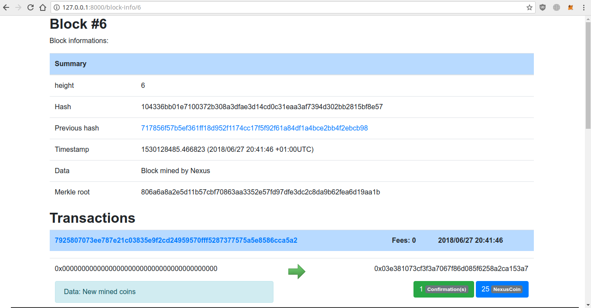
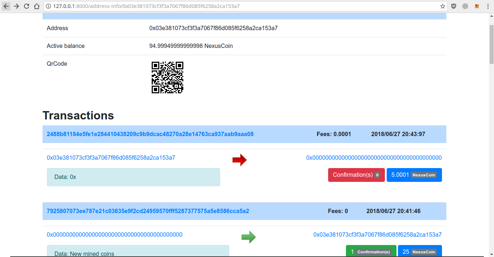

# Nexus Blockchain

A tiny implementation of blockchain technology using a custom proof of work called "Proof of Nexus"

## Installation

- Install `virtualenv` for `Python3` then clone and install the project


```bash
$> sudo pip install virtualenv
$> cd ~
$> virtualenv --python=`which python3` nexus_blockchain
$> cd nexus_blockchain/bin
$> source activate
$> cd ..
$> git clone https://github.com/Chiheb-Nexus/nexus_blockchain
$> cd nexus_blockchain
$> pip install -r requirements.txt
$> python manage.py makemigrations
$> python manage.py migrate
$> python manage.py createsuperuser
$> python manage.py runserver
```

- In a second terminal, activate the `virtualenv` then go to `~/YOUR_VENV_PATH/nexus_blockchain/interaction`

## DEMO

```bash
$> python create_wallet.py 
-> [27/06/2018 20:47:24] INFO: Wallet created - PATH: /home/chiheb/nexus_blockchain/nexus_blockchain/interaction/keystore/keys
$> python mining.py 
{"height":0,"transactions":[],"previous_hash":null,"timestamp":1530128945.550915,"data":"Genesis Block!","block_hash":"ff1099d5743ca5c21df440d9f3d2c90aec603aea46889797a9aa7899d21a7f54","merkle":"e3b0c44298fc1c149afbf4c8996fb92427ae41e4649b934ca495991b7852b855"}
-> [27/06/2018 20:49:06] INFO: Trying to find new work ...
^C
Quit [q/Q] else Continue: q

$> python create_transaction.py 
-> [27/06/2018 20:49:50] INFO: Sending Transaction:
{"signature": "0x40e376f9f40850fcf8b8aba2e64c60a28309d22ccfce2fa4464b7d196281c35b2c64f8732b1e2953bfafa8de106811986b32d907c7210330de59695a239020ca1c", "timestamp": 1530128990.355376, "from": "0xE0179D4DA5b16443C18450f35e46B2a716ae8f74", "amount": 5, "fees": 0.0001, "to": "0x0000000000000000000000000000000000000000", "data": "0x"}

-> [27/06/2018 20:49:50] INFO: Server response: {"signature":false,"status":400,"msg":"Low balance","tx_hash":null}
```

- Then you have a list of a files try them all if you want :-)

## Screenshots





# PS:

- This project still in eraly phase, only some API's are implemented.
In the next commit i'll add some more API's and some views :-)

- This project is for education purposes only and is not meant for production
