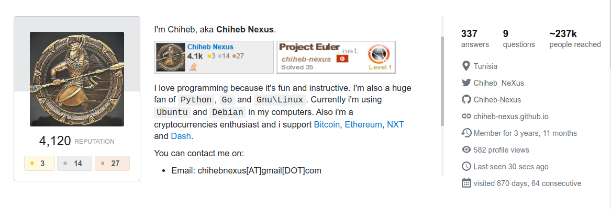

<!-- $theme: default -->

# <center><b>Formation blockchain</b></center>
<center>Animée par: <b>Ladjimi Chiheb Eddine</b></center>
<center>Date: <b>14 - 15 Juillet 2018</b></center>

---

## À propos de formateur:

</img>

---
<!--
page_number: true
Formation blockchain
-->

## Plan de la formation

- Introduction
- Définition de la blockchain
- Bitcoin blockchain

	- Transaction, minage, colored coins, ...
	- Consommation des données
	- Les défauts et problèmes de Bitcoin

- Ethereum blokchain: Au delà de la blockchain de Bitcoin

	- Transaction, minage, smart contracts, ...
	- EVM, Dapps, blockchain 2.0, ...

---

- Nexus Blockchain: Implémentation éducative de la blockchain

	- Comment créer une blockchain from scratch ?
	- Comment réecrir la blockchain pour répondre à nos besoins ?
	- Et après ?

- Workshop

	- Création, compilation et interaction avec un Smart contract d'Ethereum
	- Créez votre propre implémentation de la blockchain !
	- Les pros & cons de vos implémentations

---

## Avant de commencer

- Qui êtes vous ?
- Avez-vous de l'expérience avec un ou plusieurs langages de programmation ?
- Que connaissez-vous de la blockchain ?
- Avez-vous déjà croisé des applications basées sur la technologie de la blockchain ?
- Avez-vous essayé d'utiliser la blockchain dans vos applications ? Avez-vous croiser des problèmes ?
- Quels sont vos objectifs à la fin de cette formation ?
- Autres questions avant de commencer la formation ?

---

# <center><b>Introduction</b></center>

Une (ou un) blockchain, ou chaîne de blocs, est une technologie de stockage et de transmission d'informations <b>sans organe de contrôle</b>. Techniquement, il s'agit d'une <b>base de données distribuée</b> dont les informations envoyées par les utilisateurs et <b>les liens internes à la base</b> sont <b>vérifiés et groupés à intervalles de temps réguliers en blocs</b>, <b>l'ensemble étant sécurisé par cryptographie</b>, et formant ainsi <b>une chaîne</b>. Par extension, <b>une chaîne de blocs est une base de données distribuée qui gère une liste d'enregistrements protégés contre la falsification ou la modification par les nœuds de stockage</b>. Une blockchain est donc un registre distribué et sécurisé de toutes les transactions effectuées depuis le démarrage du système réparti. [Source: wikipedia]

---

<center></center>
<center>Représentation d’une chaîne de blocs. </center>

La chaîne principale (en noir) est composée de la plus longue suite de blocs après le bloc initial (vert). 
Les blocs orphelins sont représentés en violet.

---

### Des technologies qui ressemblent à la blockchain:

- Torrent: Distribuée mais n'est pas décentralisée
- Git: Distribuée mais n'est pas décentralisée
- Cloud storage: Distribuée mais pas décentralisée
- Zeronet: Décentalisée et distribuée
- etc ...

### Ce que la blockchain approte de nouveau: 

- Architecture décentralisée <b>et</b> distribuée
- Avec ou sans permissions
- <b>Confiance </b>

---

# <center>Bitcoin blockchain</center>

### La première implémentation de la blockchain

- Bitcoin

	- Monnaie (Digital Cash) sans organisation centrale et sans institution fiancière
	- Mécanisme de prévention contre la <b>Double Spending</b> (double dépense)
	- Une base de donnée décentralisée et distribuée

---

### Les avantages de cette implémentation

- Échanges directs entre utilisateurs (P2P)
- Frais de transactions beaucoup plus bas que les transactions monétaires traditionnelles
- Utilisable dans n'importe quel pays (contre la censure)
- Aucun ne peut contrôler votre argent seulement vous mêmes (techniquement: Celui qui possède la clé privée de l'adresse bitcoin)

---

### Comment le Bitcoin fonctionne

- Un bloc d'origine doit être crée (Genesis Block)
- Les utilisateurs échangent entre eux des jetons (Bitcoin) sous formes de transactions dans la blockchain de Bitcoin via les noeuds de Miners (mineurs full nodes) ou bien via des détenteurs de l'historique synchronisé de la blockchain de Bitcoin (light nodes)
- Entre temps, les Mineurs (Miners) cherchent de résoudre l'algorithme de preuve de travail proposé par Bitcoin (mécanisme de prévention de la double dépense) et le premier qui trouve la solution la propage dans le réseau.
- Cette solution est le Hash (le nom) du bloc trouvé et qui est constitué d'un ensemble de transaction des utilisateurs répendant à la taille du bloc déjà fixé par le logiciel de minage

--- 

- L'ensemble choisi des transactions seront soi confirmées ou non par les mineurs qui doivent tous trouver la même solution du hash du bloc pour ensuite valider ou non l'ensemble des transactions.
- Chaque mineur qui a trouvé le hash du bloc aura une récompense de la part du logiciel de minage (actuellement 12.5 btc et au début de bitcoin était 50 btc qui seront divisés sur 2 chaque 4 ans).
- La transaction déclinée ne sera pas inscrite dans la blockchain et les fonds resteront intactes et une transaction peut rester du temps sans être confirmée (problème de frais ou instabilité du réseau ou autres).
- Une transaction avec un nombre élevé de confirmations et une transaction plus sure comparant à une transaction avec un faible nombre de confirmations.
---

- Si un mineur A trouve une solution à un bloc en un instant `T` et un autre mineur B trouve la même solution en instant `T+x`. Dans ce cas, les mineurs qui ont reçu le hash du block de la part du mineur A vont essayer de résoudre le prochain bloc. S'il réussissent de trouver le prochain hash avant l'arrivée de l'information du hash trouvé par B alors la chaîne B sera rejettée et nommé `orphaned block`. Sinon, si ceux qui ont miné en dessus de bloc du mineur B ont trouvé la solution du prochain block avant ceux qui ont miné en dessus du block trouvé par A, le block trouvé par A sera un `orphaned block`. Sinon, la compétition entre les blocs restera ouverte jusqu'à la défaite d'une chaîne contre une autre, ceci est appelé `orphaned chain` 
[Pour plus d'informations: https://www.blockchain.com/fr/btc/orphaned-blocks](https://www.blockchain.com/fr/btc/orphaned-blocks)

---

- Les mineurs peuvent trouver un hash différent pour un bloc (l'ensemble des transaction n'est pas le même ou autre contrainte) et là c'est aux mineurs de décider quel bloc choisir selon la propagation de l'information du hash trouvé entre les mineurs.
- Si un mineur triche et modifie les informations d'une ou plusieurs transaction(s), ce dernier doit refaire le calcul et modifier l'ensemble des blocs qui sont superposés à cet bloc (ceci demande énormément de calcul et dans le cas présent c'est irréalisable)
- La difficulté de résolution de l'algorithme du preuve de travail augmente chaque 2016 blocks et le hash du bloc trouvé doit être inférieur à `current_target` (formule: `difficulty = difficulty_1_target/current_target`) [[Plus d'informations](https://en.bitcoin.it/wiki/Difficulty)]

---

- Le principe du mining (POW, il y'a d'autres) consiste à trouver une solution à un problème mathémathique complexe. Pour le cas de Bitcoin la résolution du problème mathématique consiste à trouver le `nonce (number used once)` qui est un chiffre combiné avec les données du bloc et passé via une fonction de hashage `SHA256` produit une résulat, un hash, qui doit être inférieure à une certaine rangée. Le `nonce` est compris entre `0 et 2^32 => 0 < nonce < 4294967296`. Ceci dit, le `nonce` est un chiffre trouvé par hasard, grâce aux propriétés du hashage, et le hash résultant doit commencer par un certain nombre de zéros (18 zéros). Exemple de block valide de bitcoin `00000000000000000026581f3528c8845e6be3a459a86cebfa6f9df1354d5d58` trouvé avec le nonce `2026595385`

---

Dans cet exemple, on suppose que les données de notre bloc forment cette chaîne de caractères: `nexus`. Le but est de trouver le nombre de fois qu'il nous faut pour ajouter le charactère `-` aux données du bloc pour avoir un hash avec l'algorithme `SHA256` qui débute par zéro. Plus de détails: [bitcoin wiki](https://en.bitcoin.it/wiki/Block_hashing_algorithm)

```python
import hashlib

def hash(a):
   instance = hashlib.sha256()
   instance.update(a.encode('utf8'))
   return instance.hexdigest()
   
data = 'nexus{}'
hash(data.format('-'))
# '63fbaa1e24501db348503652b32812abbadbd5f0c17543a746877d82428db173'
hash(data.format('-' * 2))
# '4dcb86bc3864810b2632c25e31f286107a7f25b9b243d54fb6f0fe3fb4e097e4'
...
hash(data.format('-' * 15)) # nonce = 15
# '04d3925a074d1dfcf5012af4797b70d2001e73897bd7094a3d6cc6fa5a2528a3'
```

---

- Pour consommer les données enregistrées via la blockchain de Bitcoin:

	- On peut télécharger l'intégralité de la blockchain en utilisant un client de Bitcoin ([Bitcoin core (C++)](https://github.com/bitcoin/bitcoin) ou [btcd (Go)](https://github.com/btcsuite) ou [Bcoin (NodeJS)](https://github.com/bcoin-org/bcoin), etc..)
	- On peut utiliser des Light nodes tel [Electrum](https://electrum.org/#home), etc..
	- On peut aussi utiliser les APIs des explorateurs des blocs tel [Blockchain.info](https://www.blockchain.com/fr/explorer), [Blockcypher](https://live.blockcypher.com/), etc..

---

### Colored coins: Une blockchain d'une autre blockchain

Les `colored coins (jetons colorés)` est une manière de créer et de transférer des actifs `assets` dans le réseau de la blockchain (Bitcoin ou autres). Ces jetons colorés peuvent représenter des reserves, propriétés intelligentes, des titres et des valeurs, des marchandises, autres formes de monnaies etc ... 

Le terme `Colored Coins` a été souvent défini par la représentation d'un `satoshi`, qui est la plus petite unité de Bitcoin, dans une autre forme que le Bitcoin lui même `protocol EPOBC`. Mais, actuellement, il existe d'autre manière de représentation de `Colored Coins` en utilisatn le langage de scripting `OP_RETURN`.

---

**Exemples d'utilisation de Colored Coins**

- Émission des actions: Trading, vote, payer des dividendes 
- Smart Proprety: Numéro de fabrication des voitures, etc..
- Coupons: Point de fidélité, coupon de recharge, etc ...
- Monnaie d'une communauté
- Collectibles numérique: Acheter et vendre des tableaux de peinture ou des albums de musique etc ...
- Accès et abonnement: Exemple: Dans les applications `RESTful` avec un Token d'accès et un abonnement d'une chaîne télévisée, etc ..
- etc ...
- Plus d'informations [bitcoin wiki](https://en.bitcoin.it/wiki/Colored_Coins).


---

### Les problèmes de Bitcoin

- Scalability:
	- Limite de nombre de transactions par seconde (entre ~3.3 - ~7 transactions par secondes)
	- Taille de block 1MB (>~ 1MB avec Segwit et >> 1MB avec les sidechaines)
	- ~10 minutes entre chaque bloc
- Stockage:

	- Les mineurs et les noeuds doivent enregistrer l'intergalité de la blockchain (la taille des données prennent une forme exponontielle avec le temps)
	- Beaucoup de données (précisément dans les transactions) n'ont pas une grande utilité futuriste tel la nécissité d'inscrire les inputs de chaque transaction

---

# <center>Ethereum</center>
### <center>Au délà de la Blockchain de Bitocoin</center>

---

### Introduction

Ethereum est un protocole d'échanges décentralisés permettant la création par les utilisateurs de contrats intelligents grâce à un langage Turing-complete (Solidity, Viper, Serpent, ...). Ces contrats intelligents sont basés sur un protocole informatique permettant de vérifier ou de mettre en application un contrat mutuel, ils sont déployés et consultables publiquement dans la blockchain.

---

### Différences entre Ethereum et Bitcoin

- Les transaction d'Ethereum se font en utilisation des comptes Ethereum avec un solde d'une manière nommée `State Transition` alors que les transactions de Bitcoin se basent sur les `inputs & unspent outputs` autrement nommé `UTXOs: Unspent Transaction Outputs`
- L'état du solde des comptes Ethereum (Ethereum state balances) n'est pas stocké dans la blockchain mais d'une `merkle tree` séparée nommée `Patricia Tree`.
- Les addresses Ethereum commencent par `0x` concatinée au résultat de l'algorithme de hashage `Keccak-256 (SHA3)` de clé publique `EDSCA`. Exemple: `0xb794F5eA0ba39494cE839613fffBA74279579268`. Or que en Bitcoin, utilise `base58` pour voir si l'adresse a été bien écrite ou non.

---

- Le temps entre les blocs d'Ethereum sont de l'ordre de 14-15 secondes alors qu'en Bitcoin c'est  ~10 minutes
- La récompense de minage est statique sauf en cas de changement lors d'un `Hard Fork`
- La preuve de travaille d'Ethereum utilise l'argorithme `Ethash`
- Le taxe des transactions de la blockchain d'Ethereum nommé `GAS` est calculé en fonction de la complexité de calcul, bandwidth (bande passante requise entre les noeuds) et la taille de stockage des transactions. Alors qu'en Bitocoin, le taxe est calculé en `Satoshi par Byte` : `fee = (n_inputs * 148 + n_outputs * 34 + 10) * price_per_byte` (cette formule est valide seulement pour les `P2PKH public keys`. Voir la [liste des prefixes de Bitcoin](https://en.bitcoin.it/wiki/List_of_address_prefixes)

---

- `EVM`: Ethereum Virtual Machine qui est une pile de registre de taille de `256 bit` qui sert à exécuter un code (comme la JVM de Java ou la machine virtuelle de Python) dans chaque noeud du réseau de la blockchain d'Ethereum
- Smart Contracts: Est un code écrit avec un langade de scripting qui sera compilé en `EVM bytecode` et sera par la suite exécuté par les noeuds de la blockchain d'Ethereum
- DApps: Decentralized Applications sont les applications crées avec les Smart Contracts et le EVM d'Ethereum
- Logiciels d'Entreprises: Ce sont des versions modifiées de la blockchain d'Ethereum optimisées pour les entreprises
- Permissioned ledgers: Ce sont des versions modifiées de la blockchain d'Ethereum avec des permissions tel: `Quorom de JP Morgan`

---

### Mining (Minage) avec la blockchain d'Ethereum

Le mot minage prend sa source dans le contexte de l'anologie avec l'or où l'or, les métaux précieux, sont rares tout comme les jetons numériques (Cryptocurrencies) et le seul moyen d'augmenter le volume total des jetons est de l'exploiter.
Ceci dit, le seul mode d'émission après le lancement est l'extraction (minage). Et par le biais de cette méthode, l'extraction minière, on sécurise le réseau en créant, en vérifiant, en publiant et en propageant des des blocs dans la chaîne des blocs.
Toutefois, Ethereum va passer à un nouveau algorithme de minage qui est le `Proof Of Stake (POS: passation de POW -> POS)`

Plus d'informations [Ethereum Wiki](https://github.com/ethereum/wiki/wiki/Mining)

---

# Création, compilation et déploiement d'un Smart Contract sur la blockchain d'Ethereum

---


